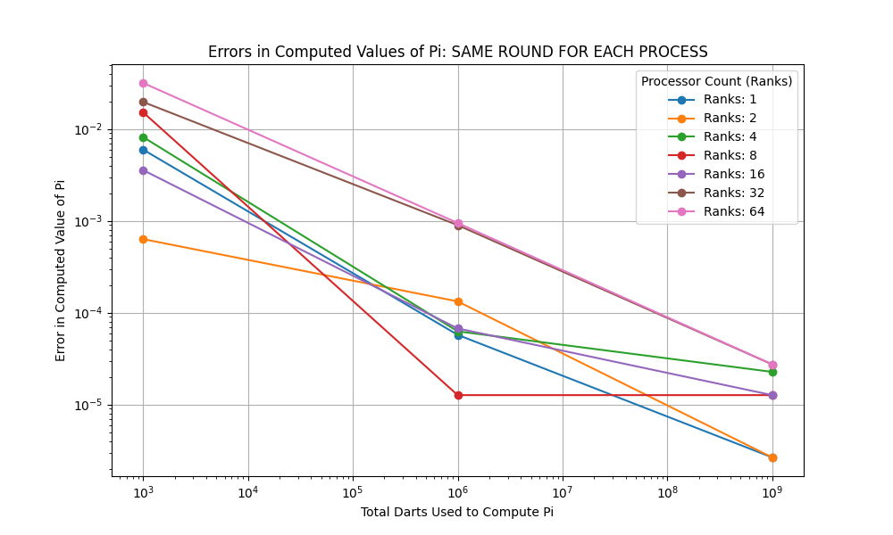

[](https://classroom.github.com/online_ide?assignment_repo_id=13660700&assignment_repo_type=AssignmentRepo)

# Project 2: Getting Started with MPI

## Due: EOD, 9 February

## Learning goals

In this project you will explore using basic MPI collectives on HPCC. After finishing this project, you should

- understand how to parallelize a simple serial code with MPI,
- understand how to use basic MPI collectives,
- be able to run MPI-parallel applications on HPCC,
- develop your theoretical understanding of key parallel computing concepts such as:
  - functional parallelism,
  - collective communication,
  - parallel scaling, and
  - parallel efficiency.

## Part 1: Warm-up Exercises

As a group, complete the following exercises from [HPSC](../assets/EijkhoutIntroToHPC2020.pdf).

- Exercise 2.18
The problem with the code is that both of the loops in the code operate on the same array without any synchronization between the loops to make sure that they behave correctly when executed.
- Exercise 2.19
Assigning chunk sizes of 1 to the threads can lead to false sharing which will cause poor performance. False sharing can happen when multiple threads modify variables that happen in the same cache which causes unnecessary synchronization which can lead to performance degradation. To avoid false sharing a good chunksize to use would distribute iterations in a way that each thread operates on a block of memory larger than a cache line. Some experimentation might be needed to find the proper chunksize.
- Exercise 2.21
    int myInfo;
    
    if (myTaskID == 0) {
        // Code for process 0
        myInfo = 123; // Example data to be sent
        MPI_Send(&myInfo, 1, MPI_INT, 1, 0, MPI_COMM_WORLD);
    } else if (myTaskID == 1) {
        // Code for process 1
        MPI_Recv(&myInfo, 1, MPI_INT, 0, 0, MPI_COMM_WORLD, &status);
        // Process received data from process 0
        printf("Received data from process 0: %d\n", myInfo);
    }

    MPI_Finalize();
    return 0;
}
- Exercise 2.22
1. Initialize MPI
2. Determine process rank (myTaskID) and total number of processes (numTasks)
3. Split the work among processes, ensuring each process has appropriate data
4. Perform the computation locally
5. Perform non-blocking sends and receives to exchange necessary boundary data
6. Wait for all non-blocking communication to complete
7. Continue with local computations
8. Finalize MPI
The disadvantage of a non-blocking solution is that there will be increased complexity and some difficulty ensuring correct synchronization
- Exercise 2.23
When looking at bandwidth of a distributed model each MPI process communicates independently with the counterparts and nodes four separate messages would need to be sent between two nodes. In a hybrid model MPI detects processes on the same node and optimizes with shared memory so messages can be bundled. So only one message would need to be sent between two nodes.
When looking at latency the distributed model would have to deal with the latency of four message transmissions. In the hybrid model since the messages are bundled the latency would be reduced to the latency of a single message transmission.
- Exercise 2.27
When computation takes no time and there is only communication overlapping the two the gain is maximized since there is no computation all time is used toward communication. This allows for maximum bandwidth utilization and potentially reduce overall communication time.
When communication takes no time and there is only computation there is no opportunity to overlap computation and communication so there is no benefit to overlapping the two.
So in general when both computation and communication take some time overlapping both can provide significant benefits. By starting communication while computation is going idle time can be reduced. Overall execution time can also be reduced. It is especially useful to overlap when communication is a significant portion of the total execution time.


Include your responses to these exercises in your project write-up.

## Part 2: Setup on HPCC

The following is a very quick tutorial on the basics of using HPCC for this class.

1. Log in to the HPCC gateway:

    ```shell
    ssh <netid>@hpcc.msu.edu
    ```

    Done.

2. Then log in to the AMD-20 cluster from the gateway:

    ```shell
    module load powertools
    amd20
    ```

    Done.

3. The default environment and software stack should be sufficient for this exercise, but if you run into issues compiling and running the code try issuing the following commands.

    ```shell
    module purge
    module load intel/2021a
    ```

    Done.

4. When using the HPCC for development and exercises in this class please do NOT just use the head node, `dev-amd20`. We will swamp the node and no one will get anything done. Instead, request an interactive job using the SLURM scheduler. An easy way to do this is to set up an alias command like so:

    ```shell
    alias devjob='salloc -n 4 --time 1:30:00'
    ```

    Done.

5. Run `devjob`, then to request 4 tasks for 90 minutes. This should be sufficient for most of the stuff we do during class, though for your projects you will at times require more resources. The above `module` and `alias` commands can be added to your `.bashrc` so that they are automatically executed when you log in.

    Done.

## Part 3: MPI Basics

1. Clone your Project 2 repo from GitHub on HPCC.

    Done.

2. In the project directory you will find a simple "Hello World!" source file in C++. Compile and run the code. E.g.,

    ```shell
    g++ hello.cpp
    ./a.out
    ```

    Done. Says "Hello, World!".

3. Now run the executable `a.out` using the MPI parallel run command and explain the output:

    ```shell
    mpiexec -n 4 ./a.out 
    ```

    Output:

    ```shell
    Hello, World!
    Hello, World!
    Hello, World!
    Hello, World!
    ```

    The output is printed 4 times because you are executing a serial application on 4 processes. Each application runs through the same "Hello World!" output.

4. Add the commands `MPI_Init` and `MPI_Finalize` to your code. Put three different print statements in your code: one before the init, one between init and finalize, and one after the finalize. Recompile and run the executable, both in serial and with `mpiexec`, and explain the output.

    When running the executable in serial, it prints the following:

    ```shell
    Hello, before Init!
    Hello, between Init and Finalize!
    Hello, after Finalize!
    ```

    This executes the three statements once because it runs the executable on a single process.

    When running the executable in parallel, using `mpiexec -n 4 ./a.out`, it prints the following:

    ```shell
    Hello, before Init!
    Hello, before Init!
    Hello, before Init!
    Hello, before Init!
    Hello, between Init and Finalize!
    Hello, between Init and Finalize!
    Hello, between Init and Finalize!
    Hello, between Init and Finalize!
    Hello, after Finalize!
    Hello, after Finalize!
    Hello, after Finalize!
    Hello, after Finalize!
    ```

    This output is because the program now runs in parallel, on four separate processes. Each process executes the same code independently.

5. Complete Exercises 2.3, 2.4, and 2.5 in the [Parallel Programing](../assets/EijkhoutParallelProgramming.pdf) book. -- ALL ONUR

## Part 4: Eat Some Pi

Pi is the ratio of a circle's circumference to its diameter. As such, the value of pi can be computed as follows. Consider a circle of radius `r` inscribed in a square of side length `r`. Randomly generate points within the square. Determine the number of points in the square that are also in the circle. If `f=nc/ns` is the number of points in the circle divided by the number of points in the square then `pi` can be approximated as `pi ~ 4f`. Note that the more points generated, the better the approximation.

1. Look at the C program `ser_pi_calc`. Extend this program using collective MPI routines to compute `pi` in parallel using the method described above. Feel free to use C++, if you prefer, of course.

    Done.

2. For the first iteration, perform the same number of "rounds" on each MPI rank. Measure the total runtime using `MPI_WTIME()`. Vary the number of ranks used from 1 to 4. How does the total runtime change?

    Below is the table displaying the total runtime results for each rank (1 through 4). Keep in mind, we use the default **10,000 darts** and **100 rounds**. We start the first `MPI_WTIME()` before the for loop that performs the pi calculations and start the second `MPI_WTIME()` after the pi calculations and overall average pi is calculated.

    | Ranks | Total Runtime (seconds)   |
    |-------|-------------------------- |
    |   1   |   0.0259022               |
    |   2   |   0.0129883               |
    |   3   |   0.00874055              |
    |   4   |   0.00653383              |

    As the number of ranks (processes) goes up, the total runtime drops. This makes sense, as the number of darts per process also as the number of ranks increases. This means less dart board scoring or iterations needed per process, or an overall reduction in cpu time.

3. Now, divide the number of "rounds" up amongst the number of ranks using the appropriate MPI routines to decide how to distribute the work. Again, run the program on 1 to 4 ranks. How does the runtime vary now?

    With dividing the rounds up per process, here is the total runtime results for each rank (1 through 4). Again, we use the default **10,000 darts** and **100 rounds**:

    | Ranks | Total Runtime (seconds)   |
    |-------|-------------------------- |
    |   1   |   0.0259121               |
    |   2   |   0.00648351              |
    |   3   |   0.00290411              |
    |   4   |   0.00163438              |

    Like question 2, as the number of ranks increases, the total runtime drops. Unlike question 2, however, the number of rounds are also split by process. That means for four processes in parallel, each process will only have to do 25 rounds of "throwing darts" instead of the full 100. That is why ranks 2, 3 and 4 are lower in runtime compared to ranks 2, 3 and 4 in question 2 above. Rank 1 is around the same runtime as rank 1 in question 2, and that makes sense. There's only one process running, so that sole process runs 100 rounds just like it does in question 2.

4. Now let's change the number of "darts" and ranks. Use your MPI program to compute `pi` using total numbers of "darts" of 1E3, 1E6, and 1E9\. For each dart count, run your code on HPCC with processor counts of 1, 2, 4, 8, 16, 32, and 64\. Keep track of the resulting value of `pi` and the runtimes. Use non-interactive jobs and modify the `submitjob.sb` script as necessary.

    We used the `submitjob.sb` script to run the non-interactive job on HPCC. This calls our `run_pi_calc.sh` which compiles + executes the `ser_pi_calc` program, along with looping through the various process and dart counts. You can view the output in the `slurm-31329571.out`. Here is a table view of our final results (same rounds and divided rounds). The values are the total runtime in seconds:

    **SAME ROUNDS PER PROCESS**

    | Darts | Ranks: 1     | Ranks: 2     | Ranks: 4     | Ranks: 8     | Ranks: 16    | Ranks: 32    | Ranks: 64    |
    |-------|--------------|--------------|--------------|--------------|--------------|--------------|--------------|
    | 1E3   | 0.00977261   | 0.00558326   | 0.00277997   | 0.00197969   | 0.0117149    | 0.010407     | 0.0174867    |
    | 1E6   | 3.64086      | 1.82106      | 0.972136     | 0.546443     | 0.310115     | 0.196127     | 0.130844     |
    | 1E9   | ...          | ...          | ...          | ...          | ...          | ...          | ...          |

    **DIVIDED ROUNDS PER PROCESS**

    | Darts | Ranks: 1     | Ranks: 2     | Ranks: 4     | Ranks: 8     | Ranks: 16    | Ranks: 32    | Ranks: 64    |
    |-------|--------------|--------------|--------------|--------------|--------------|--------------|--------------|
    | 1E3   | 0.00803623   | 0.00243511   | 0.000715013  | 0.000194071  | 8.03005e-05  | 0.000891293  | 0.00109989   |
    | 1E6   | 3.51798      | 0.898393     | 0.227843     | 0.0586256    | 0.0148855    | 0.00428933   | 0.00108942   |
    | 1E9   | ...          | ...          | ...          | ...          | ...          | ...          | ...          |

5. For each processor count, plot the resulting errors in your computed values of `pi` compared to the true value as functions of the number of darts used to compute it. Use log-log scaling on this plot. What is the rate of convergence of your algorithm for computing `pi`? Does this value make sense? Does the error or rate of convergence to the correct answer vary with processor count? Should it?

    Below is the plot results and convergence rates, generated by `plot_mpi_charts.py`, for both the same rounds used for each process and divided rounds among processes:

    **SAME ROUNDS PER PROCESS**
    

    | Processor Count (Ranks) | Convergence Rate |
    |--------------------------|------------------|
    | 1                        | -0.6724          |
    | 2                        | -0.2261          |
    | 4                        | -0.7050          |
    | 8                        | -1.0266          |
    | 16                       | -0.5747          |
    | 32                       | -0.4471          |
    | 64                       | -0.5084          |

    **DIVIDED ROUNDS PER PROCESS**
    

    | Processor Count (Ranks) | Convergence Rate |
    |--------------------------|------------------|
    | 1                        | -0.6724          |
    | 2                        | -0.7050          |
    | 4                        | -0.6630          |
    | 8                        | -0.4757          |
    | 16                       | -1.1709          |
    | 32                       | -0.4127          |
    | 64                       | -0.5230          |

    These convergence rates make sense and align with the plots. For example, the same rounds per process plot shows rank 8 (red line) with the steepest slope, which coorelates to the convergence rate results. Additionally, it makes sense that these values are negative because as the dart count goes up, the errors in calculating Pi go down. This does vary slightly by processor and I believe it should vary, although I don't believe it should always correlate to a larger convergence rate value due to various factors such as dimishing returns or resource contention amongst other processes.

6. For each dart count, make a plot of runtime versus processor count. Each line represents a "strong scaling" study for your code. For each dart count, also plot the "ideal" scaling line. Calculate the parallel scaling efficiency of your code for each dart count. Does the parallel performance vary with dart count? Explain your answer.

    Below is the plot results, generated by `plot_mpi_charts.py`, for both the same rounds used for each process and divided rounds among processes:

    **SAME ROUNDS PER PROCESS**

    TODO: CHRIS

    **DIVIDED ROUNDS PER PROCESS**

    TODO: CHRIS

7. Going further. Try running your code on different node types on HPCC with varied core counts. In particular, try to ensure that your runs utilize multiple nodes so that the communication network is used. Do you see a change in the communication cost when the job is run on more than one node?

    Yes, when running across different node types there is some latency or communication overhead that effects the performance of the program as I noticed an increase in the runtime.

## What to turn-in

To your git project repo, commit your final working code for the above exercises and a concise write-up including responses to the warm-up exercises, performance and accuracy data for your calculations of `pi`, the plots made in Part 4, and detailed responses to the questions posed concerning your results.

## Project Notes for Those Running It

On HPCC you need to run the following:

```shell
module load GCC/9.3.0
module load intel/2021a
```

This will allow you to compile:

```shell
mpicxx -o ser_pi_calc ser_pi_calc.cpp -std=c++17 -O3
```

And execute our program:

```shell
mpiexec -n 4 ./ser_pi_calc 100 10000
```

### Running SBatch script

To run the `submitjob.sb` just run in the root of project:

```shell
sbatch submitjob.sb
```

This script was primarily setup for part 4, question 4.

## Our Project Deliverables

- The project writeup in this `README.md`
- `hello.cpp` and the executable (`a.out`) for Part 3
- `ser_pi_calc.cpp` and the executable (`ser_pi_calc`) for Part 4
- `data_readme_part4_q2_q3.csv` for the data in Part 4, question 2 and 3
- `run_pi_calc_part4_q2_q3.sh` for executing the darts/rounds asked in Part 4, question 2 and 3
- `run_pi_calc.sh` for executing the darts/rounds asked in Part 4, question 4
- `submitjob.sb` for running a job on HPCC as part of Part 4, question 4
- `data_readme_part4_q4.csv` used for the plots generated by the `XXX.py` file in Part 4, question 5 and 6
- `plots/` folder containing the plotted assets for the writeup
